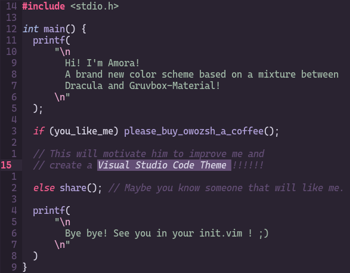

# Amora !

### Introduction (Read the code!)

> Amora is still under development. You can help me by sending issues or donating (see support section).

## Installation

Make sure to set your terminal background color to #2A2331 

### Using VIM PLUG

- Plug 'owozsh/amora'
- colorscheme amora
- reopen VIM/NEOVIM and run :PlugInstall

### Manually

- Create a folder named 'colors' in your '.config/nvim/' directory. ('.config/nvim/colors');
- Run on your terminal:
	- git clone https://github.com/owozsh/amora
	- cd amora
	- ./install.sh

## Support

[Buy me a coffee! :)](https://www.buymeacoffee.com/owozsh)

## Configuration

Put these settings before 'colorscheme amora'

- activate focus mode
	- let g:mode = 'focus'
- activate mirtilo mode
	- let g:mode = 'mirtilo'
